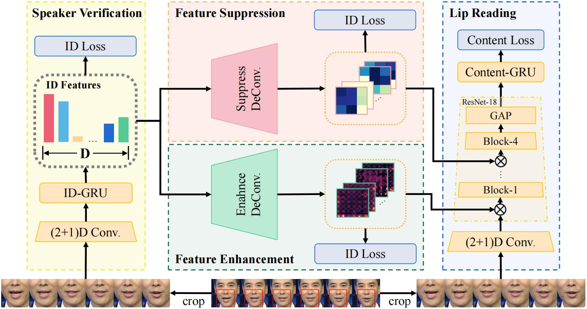

# LSHUC
BMVC'23 Learning Separable Hidden Unit Contributions for Speaker-Adaptive Lip-Reading


## OverView
This is an official implementation, based on the 2023 paper titled "Learning Separable Hidden Unit Contributions for Speaker-Adaptive Lip-Reading." This is a speaker-adaptive lip-reading method.

## File Structure
```
.
├── config.py              # Configuration file, likely for setting up parameters or environment variables
├── cvtransforms.py        # File for computer vision transformations
├── dataloader             # Folder for data loading utilities
│   ├── dataset_op.py      # Dataset if ID information is needed
│   ├── dataset_pl.py      # Dataset implement in pytorch lightning
├── img                    
│   ├── overview.jpg       
│   └── overview.pdf       
├── label_sorted.txt       # Text file containing sorted labels of LRW
├── models                 # Folder containing different model architectures
│   ├── model_enhance.py   # Model for feature enhancement
│   ├── model_ensemble.py  # Model for ensemble model
│   ├── model_r2plus1d.py  # Baseline model
│   ├── model_SD.py        # Speaker verification module
├── README.md              # Readme file for project documentation
├── requirements.txt       # File listing all the project's dependencies
├── scripts                # Scripts for data preparation
│   └── prepare_lrw.py     # Script for preparing the LRW dataset
├── train_baseline.py      # Training script for baseline model
├── train_enhance.py       # Training script for feature enhancement model
├── train_ensemble.py      # Training script for ensemble models
└── train_SD.py            # Training script for speaker verification module
```
## Data Preparation
### Prepare LRW Dataset
1. Download [LRW Dataset](http://www.robots.ox.ac.uk/~vgg/data/lip_reading/lrw1.htm):
2. Run `scripts/prepare_lrw.py`  to generate training samples of LRW :

```
python scripts/prepare_lrw.py
```

The mouth videos, labels, and word boundary information will be saved in the `.pkl` format. We pack image sequence as `jpeg` format into our `.pkl` files and decoding via [PyTurboJPEG](https://github.com/lilohuang/PyTurboJPEG). Please remember to set the `path` in `config.py` to the location where you have downloaded and pre-processed the dataset.
### Prepare LRW-ID 
LRW-ID is a re-partitioning of LRW data. You need to download the corresponding split from [LRW-ID](https://github.com/ms-dot-k/LRW_ID).

Please remember to set the `split_path` in `config.py` to the location where you have downloaded and pre-processed the dataset.
## Setup
Set up environment
```
pip install -r requirements.txt
```
## Training Steps
We propose a 3-step training strategy for our speaker adaptive model, focusing on separate tasks at each step. Please refer to the 'Training Details' subsection in the 'More Detailed Experiments' section of the supplementary materials.

Firstly, we train the left [speaker verification module](#speaker-verification-module) with $L^{ID}_{triple}$ and the right [lip reading modules](#lip-reading-modules) with $L^{VSR}_{CE}$ separately. 

Then, we introduce the [feature enhancement module](#enhance-module) together with  the learned speaker verification module and the lip reading module to continue the training process. 

Finally, we freeze the feature enhancement module and the speaker verification module to introduce the [suppression module](#ensemble-module) to continue training until convergence. 
### Speaker Verification Module
Please set up config.py, e.g.
```
path = '/data1/lrw_roi_80_116_175_211_npy_gray_pkl_jpeg/'
split_path = '/home/luosongtao/code/LRW_ID-main/Splits/'
random_seed = 251
batch_size = 130
gpus = 2
base_lr = 2e-4 * batch_size/32.0 
num_workers = 8
max_epoch = 40
resume_path =None
reg = 0.5
precision = 16
verison=0
alpha=0.1

``` 
and train with command:
```
python train_SD.py
```
### Lip Reading Modules
Please set up config.py, e.g.
```
path = '/data1/lrw_roi_80_116_175_211_npy_gray_pkl_jpeg/'
split_path = '/home/luosongtao/code/LRW_ID-main/Splits/'
random_seed = 251
batch_size = 130
gpus = 2
base_lr = 2e-4 * batch_size/32.0 
num_workers = 8
max_epoch = 10
resume_path =None
reg = 0.5
precision = 16
verison=0
alpha=0.1

``` 
and train with command:
```
python train_baseline.py
```
### Enhance Module
Please set up config.py, e.g.
```
path = '/data1/lrw_roi_80_116_175_211_npy_gray_pkl_jpeg/'
split_path = '/home/luosongtao/code/LRW_ID-main/Splits/'
random_seed = 251
batch_size = 130
gpus = 2
base_lr = 2e-4 * batch_size/32.0 
num_workers = 8
max_epoch = 10
resume_path =None
reg = 0.5
precision = 16
verison=0
alpha=0.1

``` 
and train with command:
```
python train_enhance.py --SD_model_path /home/luosongtao/code/LSHUC/SD_logs/crop_flip_cl_251/version_63/checkpoints/checkpoints-epoch=09-val_loss=0.01.ckpt --baseline_model_path /home/luosongtao/code/LSHUC/Baseline_logs/crop_flip_cl_251/version_1/checkpoints/checkpoints-epoch=37-val_loss=0.57-val_wer=0.13.ckpt
```
### Ensemble Module
Please set up config.py, e.g.
```
path = '/data1/lrw_roi_80_116_175_211_npy_gray_pkl_jpeg/'
split_path = '/home/luosongtao/code/LRW_ID-main/Splits/'
random_seed = 251
batch_size = 130
gpus = 2
base_lr = 2e-4 * batch_size/32.0 
num_workers = 8
max_epoch = 10
resume_path =None
reg = 0.5
precision = 16
verison=0
alpha=0.1

``` 
and train with command:
```
python train_ensemble.py --enhance_model_path /home/luosongtao/code/LSHUC/Enhance_logs/crop_flip_cl_251/version_1/checkpoints/checkpoints-epoch=09-val_loss=0.55-val_wer=0.12.ckpt
```
## Benchmark
| Method  |  $L^{ID}_{{triple}}$  | $ L^{Enh}_{{triple}} $ & $ L^{Sup}_{{triple}} $ | $ L^{VSR}_{CE} $ | Acc(%) |
| ------- | ---------------------------- | ------------------------------------------------------------- | ------------------ | ------ | 
| Baseline| -                           | -                              | ✓                 | 87.25    |
| Ours    | ❌                          | ❌                              | ✓                 | 87.73    |
| Ours    | ✓                           | ❌                              | ✓                 | 87.74    |
| Ours    | ❌                          | ✓                              | ✓                 | 87.75    |
| Ours    | ✓                           | ✓                              | ✓                 | **87.91**|
## Contact
luosongtao18@mails.ucas.ac.cn
## Citation